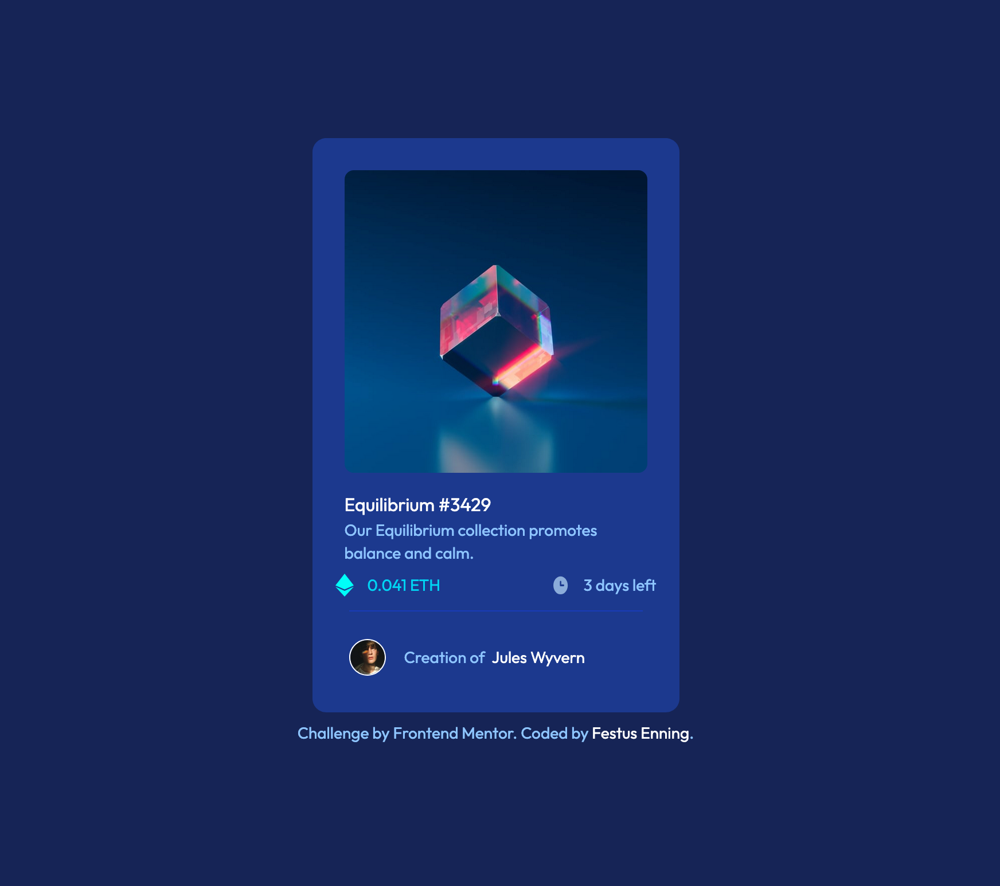

# Frontend Mentor - NFT preview card component solution

This is a solution to the [NFT preview card component challenge on Frontend Mentor](https://www.frontendmentor.io/challenges/nft-preview-card-component-SbdUL_w0U). Frontend Mentor challenges help you improve your coding skills by building realistic projects. 

## Table of contents

- [Overview](#overview)
  - [The challenge](#the-challenge)
  - [Screenshot](#screenshot)
  - [Links](#links)
  - [Built with](#built-with)
  - [What I learned](#what-i-learned)
  - [Useful resources](#useful-resources)
- [Author](#author)

## Overview

### The challenge

Users should be able to:

- View the optimal layout depending on their device's screen size
- See hover states for interactive elements

### Screenshot



### Links

- Solution URL: [Repository](https://github.com/Enning94/NFT-preview-card-component-solution)

- Live Site URL: [Live Demo](https://enning94.github.io/NFT-preview-card-component-solution/)


### Built with

- Semantic HTML5 markup
- Tailwind CSS for styling and responsiveness
- Flexbox and utility-first layout classes
- Mobile-first design workflow

### What I learned

Working on this project taught me a lot about combining clean, semantic HTML with modern Tailwind CSS workflows.
I learned how to set up Tailwind using the CLI, structure responsive layouts with Flexbox and Tailwind’s utility classes, and apply hover effects efficiently.

Here are a few snippets I’m proud of:

```html
<!-- Centering content using Tailwind utilities -->
<div class="flex flex-col items-center justify-center min-h-screen bg-blue-950">
  <h1 class="text-white text-3xl font-bold hover:text-cyan-400 transition-colors duration-300">
    Equilibrium #3429
  </h1>
</div>
```
```css
/* Base styles defined in input.css */
@import "tailwindcss";

@theme {
  --font-outfit: "Outfit", sans-serif;
}

body {
  font-family: var(--font-outfit);
  font-size: 18px;
}

```

### Useful resources

- [Tailwind CSS Documentation](https://tailwindcss.com/docs/installation/tailwind-cli) - he official docs were extremely helpful for understanding how to set up Tailwind with the CLI, use utility classes effectively, and manage responsive layouts. I especially liked how well it explains the mobile-first approach and custom themes.

## Author

- Website - [Festus Enning](https://enning94.github.io/Personal-portfolio/)
- Frontend Mentor - [@Enning94](https://www.frontendmentor.io/profile/Enning94)
- Twitter - [@Nana_Akyerefi](https://x.com/Nana_Akyerefi)

